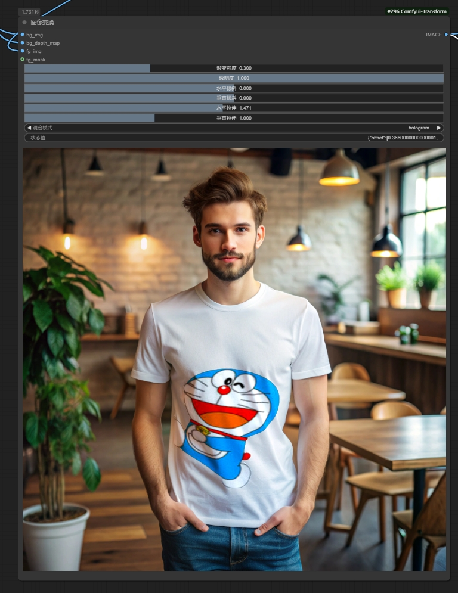
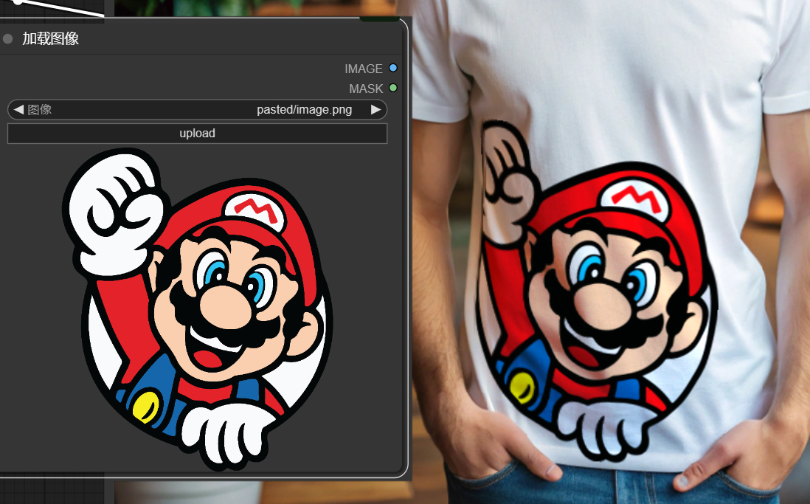

# Comfyui-Transform
The simple implementation of the recraft sticker function

Recraft贴图功能的简单实现，离理想效果差的远，无力优化遂开源

* 这个节点可以自由变换贴图，类似PS置换形变

# 2025-02-20更新

* 更新了three.min.js本地文件，解决了在ComfyUI中因网络问题无法正常显示的问题
* 增加水平拉伸，垂直拉伸，以及右键可输出属性
* 优化了锯齿问题,切换模式无反应问题
* 特别优化了hologram全息投影模式，效果更佳，强烈推荐

# 商务合作

wechat: wenrulaogou2033

如果您需要源码商用，可以付费购买，开源不易，请尊重作者劳动成果

# 如果您受益于本项目，不妨请作者喝杯咖啡，您的支持是我最大的动力

    
    

