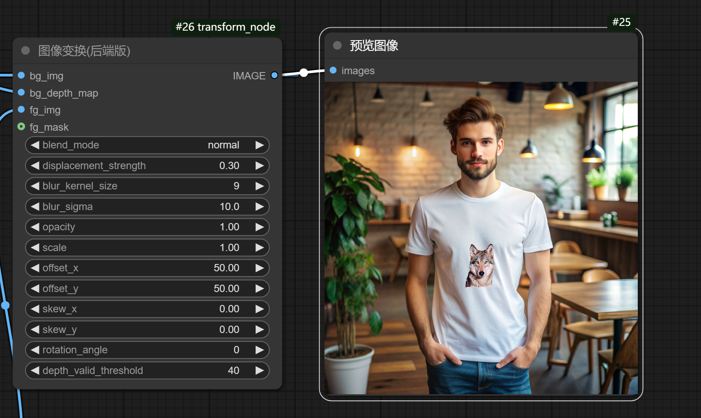

# Comfyui-Transform
The simple implementation of the recraft sticker function

Recraft贴图功能的简单实现，这一版解决了之前的一些技术难题，效果很棒！

* 这个节点可以自由变换贴图，类似PS置换形变
* 你可以使用它来实现2.5D贴图，logo贴图等更多创意！


# 安装说明

1. 确保你已经安装了 Python 3.x。
2. 克隆这个项目：
   ```bash
   git clone https://github.com/LAOGOU-666/Comfyui-Transform.git
   ```
3. 进入项目目录：
   ```bash
   cd Comfyui-Transform
   ```
4. 安装依赖：
   ```bash
   pip install -r requirements.txt
   ```

# 2025-02-20更新

* 更新了three.min.js本地文件，解决了在ComfyUI中因网络问题无法正常显示的问题
* 增加水平拉伸，垂直拉伸，以及右键可输出属性
* 优化了锯齿问题,切换模式无反应问题
* 特别优化了hologram全息投影模式，效果更佳，强烈推荐


# 2025-4-28更新
* 更新了继承坐标，缩放以及参数，支持批量操作

# 后端版本出炉，相对于前端优化了多项问题，批量操作效果更稳定


买家秀


该后端版本为非公开版本，需要请详询下方联系方式

# 商务合作

<p style="font-size: 24px;">wechat: wenrulaogou2033</p>

如果您需要源码商用，可以付费购买，开源不易，请尊重作者劳动成果

# 如果您受益于本项目，不妨请作者喝杯咖啡，您的支持是我最大的动力

<div style="display: flex; justify-content: left; gap: 20px;">
    
    
</div>


